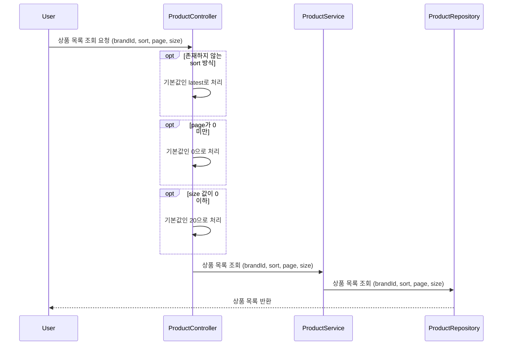

```mermaid
sequenceDiagram
    participant U as User
    participant PC as ProductController
    participant PS as ProductService
    participant PR as ProductRepository
    U ->> PC: 상품 목록 조회 요청 (brandId, sort, page, size)
    opt 존재하지 않는 sort 방식
        PC ->> PC: 기본값인 latest로 처리
    end
    opt page가 0 미만
        PC ->> PC: 기본값인 0으로 처리
    end
    opt size 값이 0 이하
        PC ->> PC: 기본값인 20으로 처리
    end
    PC ->> PS: 상품 목록 조회 (brandId, sort, page, size)
    PS ->> PR: 상품 목록 조회 (brandId, sort, page, size)
    PR -->> U: 상품 목록 반환 
```
