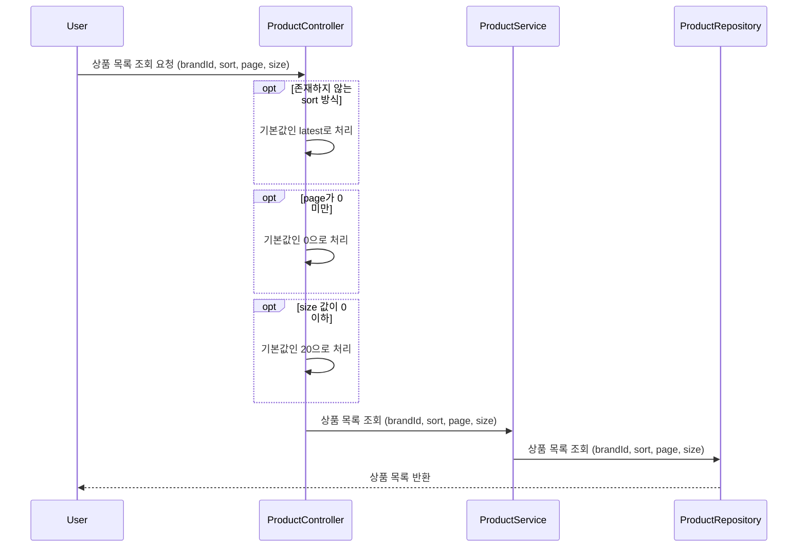
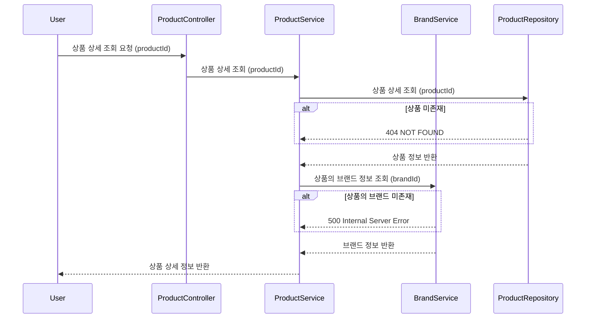
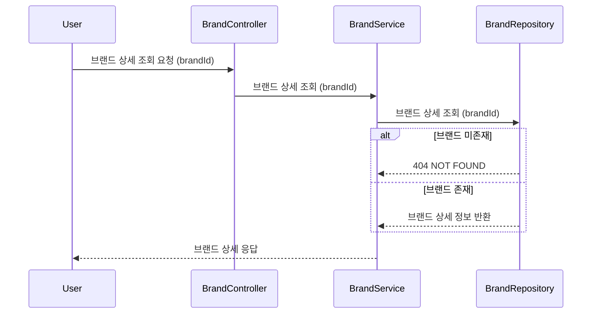

## 상품 목록 조회

```mermaid
sequenceDiagram
    participant U as User
    participant PC as ProductController
    participant PS as ProductService
    participant PR as ProductRepository
    U ->> PC: 상품 목록 조회 요청 (brandId, sort, page, size)
    opt 존재하지 않는 sort 방식
        PC ->> PC: 기본값인 latest로 처리
    end
    opt page가 0 미만
        PC ->> PC: 기본값인 0으로 처리
    end
    opt size 값이 0 이하
        PC ->> PC: 기본값인 20으로 처리
    end
    PC ->> PS: 상품 목록 조회 (brandId, sort, page, size)
    PS ->> PR: 상품 목록 조회 (brandId, sort, page, size)
    PR -->> U: 상품 목록 반환 
```

## 상품 상세 조회

```mermaid
sequenceDiagram
    participant U as User
    participant PC as ProductController
    participant PS as ProductService
    participant BS as BrandService
    participant PR as ProductRepository
    U ->> PC: 상품 상세 조회 요청 (productId)
    PC ->> PS: 상품 상세 조회 (productId)
    PS ->> PR: 상품 상세 조회 (productId)
    alt 상품 미존재
        PR -->> PS: 404 NOT FOUND
    end
    PR -->> PS: 상품 정보 반환
    PS ->> BS: 상품의 브랜드 정보 조회 (brandId)
    alt 상품의 브랜드 미존재
        BS -->> PS: 500 Internal Server Error
    end
    BS -->> PS: 브랜드 정보 반환
    PS -->> U: 상품 상세 정보 반환
```

## 브랜드 상세 조회

```mermaid
sequenceDiagram
    participant U as User
    participant BC as BrandController
    participant BS as BrandService
    participant BR as BrandRepository
    U ->> BC: 브랜드 상세 조회 요청 (brandId)
    BC ->> BS: 브랜드 상세 조회 (brandId)
    BS ->> BR: 브랜드 상세 조회 (brandId)
    alt 브랜드 미존재
        BR -->> BS: 404 NOT FOUND
    else 브랜드 존재
        BR -->> BS: 브랜드 상세 정보 반환
    end
    BS -->> U: 브랜드 상세 응답
```