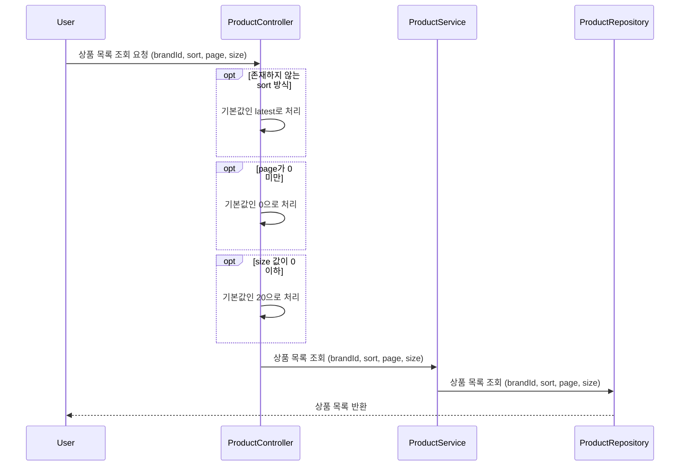
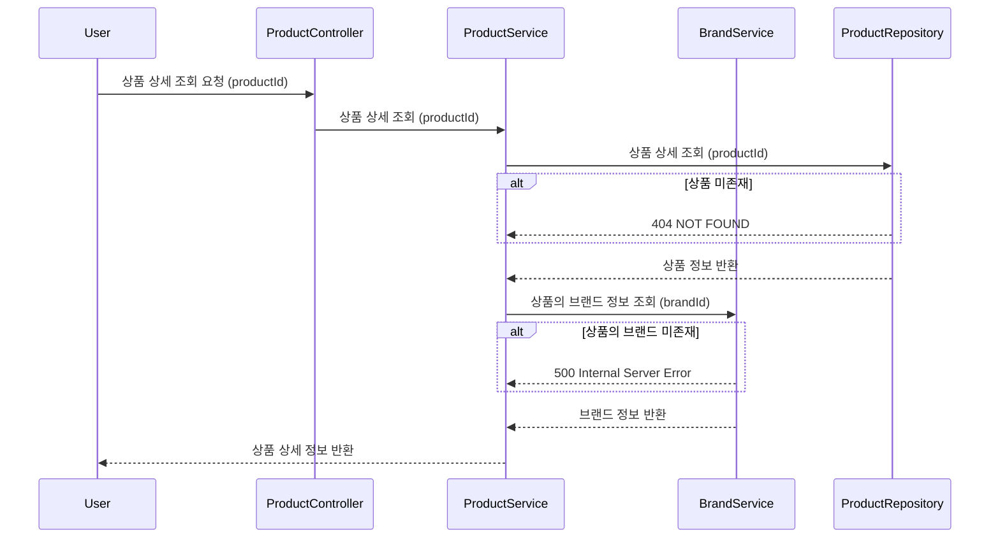
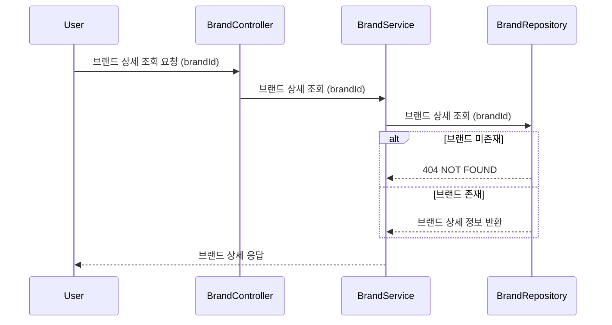
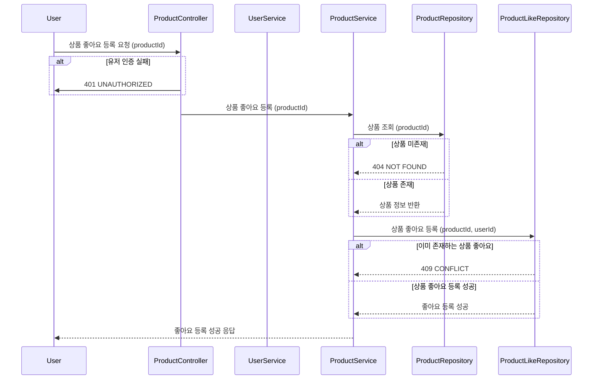
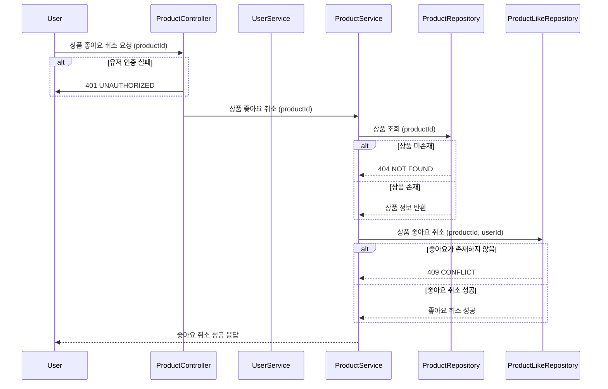
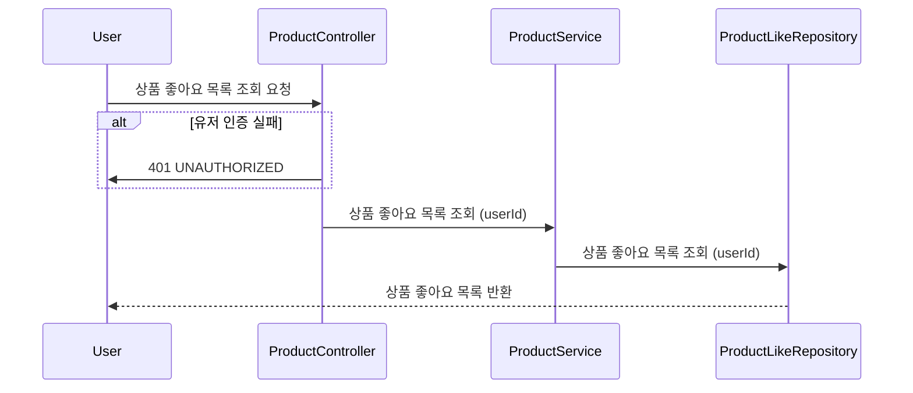
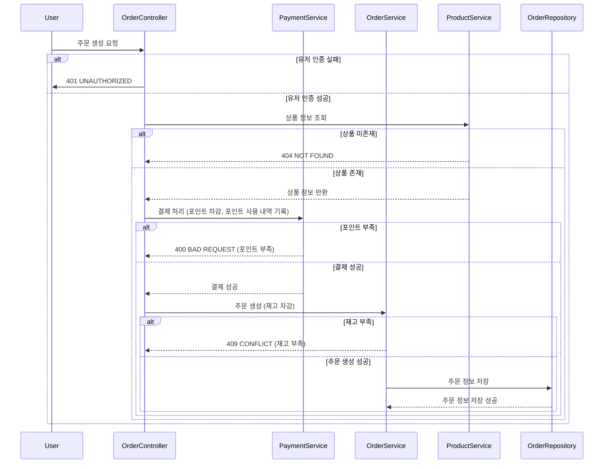

## 상품 목록 조회

```mermaid
sequenceDiagram
    participant U as User
    participant PC as ProductController
    participant PS as ProductService
    participant PR as ProductRepository
    U ->> PC: 상품 목록 조회 요청 (brandId, sort, page, size)
    opt 존재하지 않는 sort 방식
        PC ->> PC: 기본값인 latest로 처리
    end
    opt page가 0 미만
        PC ->> PC: 기본값인 0으로 처리
    end
    opt size 값이 0 이하
        PC ->> PC: 기본값인 20으로 처리
    end
    PC ->> PS: 상품 목록 조회 (brandId, sort, page, size)
    PS ->> PR: 상품 목록 조회 (brandId, sort, page, size)
    PR -->> U: 상품 목록 반환 
```

## 상품 상세 조회

```mermaid
sequenceDiagram
    participant U as User
    participant PC as ProductController
    participant PS as ProductService
    participant BS as BrandService
    participant PR as ProductRepository
    U ->> PC: 상품 상세 조회 요청 (productId)
    PC ->> PS: 상품 상세 조회 (productId)
    PS ->> PR: 상품 상세 조회 (productId)
    alt 상품 미존재
        PR -->> PS: 404 NOT FOUND
    end
    PR -->> PS: 상품 정보 반환
    PS ->> BS: 상품의 브랜드 정보 조회 (brandId)
    alt 상품의 브랜드 미존재
        BS -->> PS: 500 Internal Server Error
    end
    BS -->> PS: 브랜드 정보 반환
    PS -->> U: 상품 상세 정보 반환
```

## 브랜드 상세 조회

```mermaid
sequenceDiagram
    participant U as User
    participant BC as BrandController
    participant BS as BrandService
    participant BR as BrandRepository
    U ->> BC: 브랜드 상세 조회 요청 (brandId)
    BC ->> BS: 브랜드 상세 조회 (brandId)
    BS ->> BR: 브랜드 상세 조회 (brandId)
    alt 브랜드 미존재
        BR -->> BS: 404 NOT FOUND
    else 브랜드 존재
        BR -->> BS: 브랜드 상세 정보 반환
    end
    BS -->> U: 브랜드 상세 응답
```

## 상품 좋아요 등록

```mermaid
sequenceDiagram
    participant U as User
    participant PC as ProductController
    participant US as UserService
    participant PS as ProductService
    participant PR as ProductRepository
    participant PLR as ProductLikeRepository
    U ->> PC: 상품 좋아요 등록 요청 (productId)
    alt 유저 인증 실패
        PC ->> U: 401 UNAUTHORIZED
    end
    PC ->> PS: 상품 좋아요 등록 (productId)
    PS ->> PR: 상품 조회 (productId)
    alt 상품 미존재
        PR -->> PS: 404 NOT FOUND
    else 상품 존재
        PR -->> PS: 상품 정보 반환
    end
    PS ->> PLR: 상품 좋아요 등록 (productId, userId)
    alt 이미 존재하는 상품 좋아요
        PLR -->> PS: 409 CONFLICT
    else 상품 좋아요 등록 성공
        PLR -->> PS: 좋아요 등록 성공
    end
    PS -->> U: 좋아요 등록 성공 응답
```

## 상품 좋아요 취소

```mermaid
sequenceDiagram
    participant U as User
    participant PC as ProductController
    participant US as UserService
    participant PS as ProductService
    participant PR as ProductRepository
    participant PLR as ProductLikeRepository
    U ->> PC: 상품 좋아요 취소 요청 (productId)
    alt 유저 인증 실패
        PC ->> U: 401 UNAUTHORIZED
    end
    PC ->> PS: 상품 좋아요 취소 (productId)
    PS ->> PR: 상품 조회 (productId)
    alt 상품 미존재
        PR -->> PS: 404 NOT FOUND
    else 상품 존재
        PR -->> PS: 상품 정보 반환
    end
    PS ->> PLR: 상품 좋아요 취소 (productId, userId)
    alt 좋아요가 존재하지 않음
        PLR -->> PS: 409 CONFLICT
    else 좋아요 취소 성공
        PLR -->> PS: 좋아요 취소 성공
    end
    PS -->> U: 좋아요 취소 성공 응답
```

## 상품 좋아요 목록 조회

```mermaid
sequenceDiagram
    participant U as User
    participant PC as ProductController
    participant PS as ProductService
    participant PLR as ProductLikeRepository
    U ->> PC: 상품 좋아요 목록 조회 요청
    alt 유저 인증 실패
        PC ->> U: 401 UNAUTHORIZED
    end
    PC ->> PS: 상품 좋아요 목록 조회 (userId)
    PS ->> PLR: 상품 좋아요 목록 조회 (userId)
    PLR -->> U: 상품 좋아요 목록 반환
```

## 주문 생성

```mermaid
sequenceDiagram
    participant U as User
    participant OC as OrderController
    participant PMS as PaymentService
    participant OS as OrderService
    participant PS as ProductService
    participant OR as OrderRepository
    U ->> OC: 주문 생성 요청
    alt 유저 인증 실패
        OC ->> U: 401 UNAUTHORIZED
    else 유저 인증 성공
        OC ->> PS: 상품 정보 조회
        alt 상품 미존재
            PS -->> OC: 404 NOT FOUND
        else 상품 존재
            PS -->> OC: 상품 정보 반환
            OC ->> PMS: 결제 처리 (포인트 차감, 포인트 사용 내역 기록)
            alt 포인트 부족
                PMS -->> OC: 400 BAD REQUEST (포인트 부족)
            else 결제 성공
                PMS -->> OC: 결제 성공
                OC ->> OS: 주문 생성 (재고 차감)
                alt 재고 부족
                    OS -->> OC: 409 CONFLICT (재고 부족)
                else 주문 생성 성공
                    OS ->> OR: 주문 정보 저장
                    OR -->> OS: 주문 정보 저장 성공
                end
            end
        end
    end
```