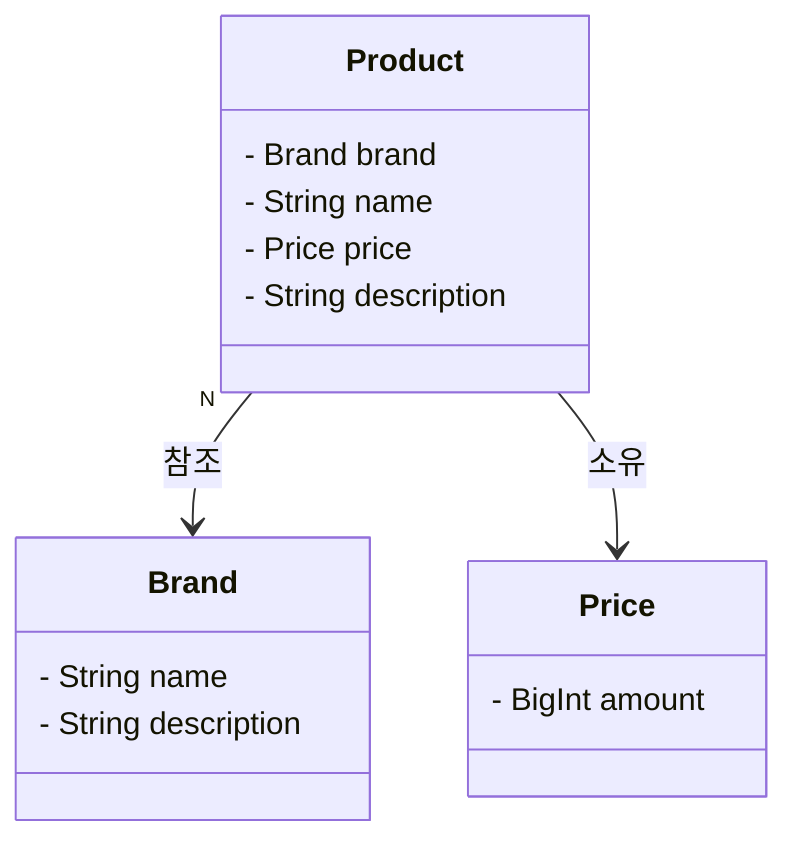

```mermaid
classDiagram
    class Product {
        - Brand brand
        - String name
        - Price price
        - String description
    }

    class Brand {
        - String name
        - String description
    }

    class Price {
        - BigInt amount
    }

    Product "N" --> Brand: 참조
    Product --> Price: 소유
```