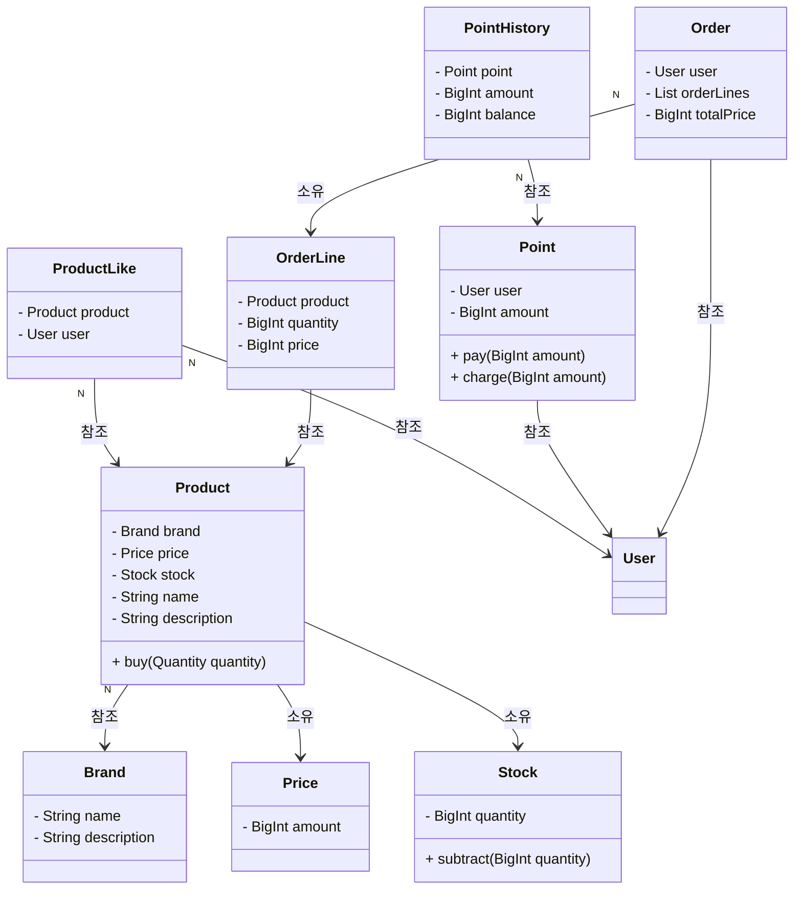

```mermaid
classDiagram
    class Product {
        - Brand brand
        - Price price
        - Stock stock
        - String name
        - String description
        + buy(Quantity quantity)
    }

    Product "N" --> Brand: 참조
    Product --> Price: 소유
    Product --> Stock: 소유

    class Price {
        - BigInt amount
    }

    class Stock {
        - BigInt quantity
        + subtract(BigInt quantity)
    }

    class ProductLike {
        - Product product
        - User user
    }

    ProductLike "N" --> Product: 참조
    ProductLike "N" --> User: 참조

    class Brand {
        - String name
        - String description
    }

    class User {
    }

    class Point {
        - User user
        - BigInt amount
        + pay(BigInt amount)
        + charge(BigInt amount)
    }

    Point --> User: 참조

    class PointHistory {
        - Point point
        - BigInt amount
        - BigInt balance
    }

    PointHistory "N" --> Point: 참조

    class Order {
        - User user
        - List<OrderLine> orderLines
        - BigInt totalPrice
    }

    Order --> User: 참조

    class OrderLine {
        - Product product
        - BigInt quantity
        - BigInt price
    }

    Order "N" --> OrderLine: 소유
    OrderLine --> Product: 참조
```