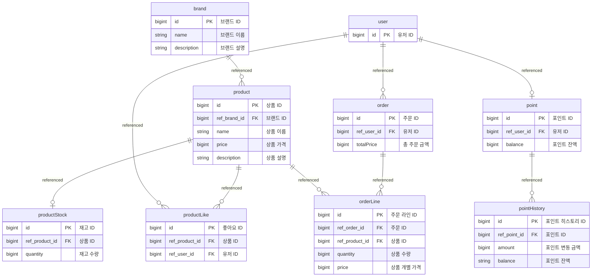

```mermaid
erDiagram
    product {
        bigint id PK "상품 ID"
        bigint ref_brand_id FK "브랜드 ID"
        string name "상품 이름"
        bigint price "상품 가격"
        string description "상품 설명"
    }

    product ||--o{ productLike: "referenced"

    productLike {
        bigint id PK "좋아요 ID"
        bigint ref_product_id FK "상품 ID"
        bigint ref_user_id FK "유저 ID"
    }

    productStock {
        bigint id PK "재고 ID"
        bigint ref_product_id FK "상품 ID"
        bigint quantity "재고 수량"
    }

    product ||--o| productStock: "referenced"

    brand {
        bigint id PK "브랜드 ID"
        string name "브랜드 이름"
        string description "브랜드 설명"
    }

    brand ||--o{ product: "referenced"

    user {
        bigint id PK "유저 ID"
    }

    user ||--o{ productLike: "referenced"
    user ||--o| point: "referenced"

    point {
        bigint id PK "포인트 ID"
        bigint ref_user_id FK "유저 ID"
        bigint balance "포인트 잔액"
    }

    point ||--o{ pointHistory: "referenced"

    pointHistory {
        bigint id PK "포인트 히스토리 ID"
        bigint ref_point_id FK "포인트 ID"
        bigint amount "포인트 변동 금액"
        string balance "포인트 잔액"
    }

    order {
        bigint id PK "주문 ID"
        bigint ref_user_id FK "유저 ID"
        bigint totalPrice "총 주문 금액"
    }

    user ||--o{ order: "referenced"
    order ||--o{ orderLine: "referenced"

    orderLine {
        bigint id PK "주문 라인 ID"
        bigint ref_order_id FK "주문 ID"
        bigint ref_product_id FK "상품 ID"
        bigint quantity "상품 수량"
        bigint price "상품 개별 가격"
    }

    product ||--o{ orderLine: "referenced"

```