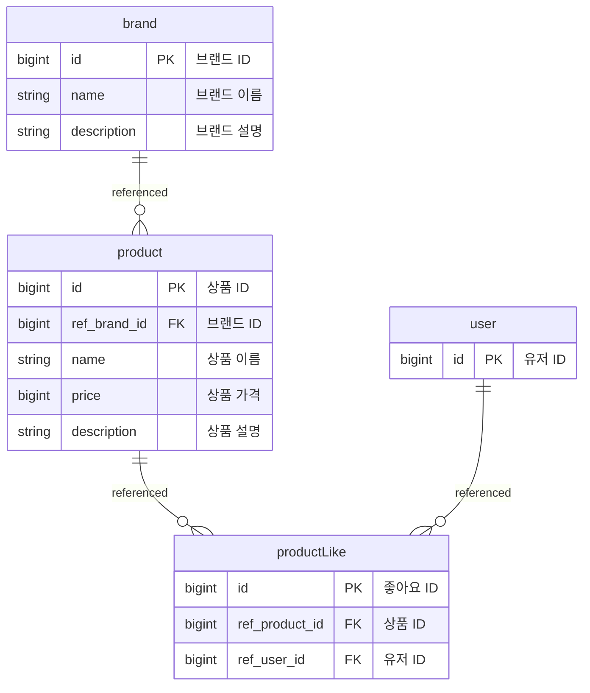

```mermaid
erDiagram
    product {
        bigint id PK "상품 ID"
        bigint ref_brand_id FK "브랜드 ID"
        string name "상품 이름"
        bigint price "상품 가격"
        string description "상품 설명"
    }

    productLike {
        bigint id PK "좋아요 ID"
        bigint ref_product_id FK "상품 ID"
        bigint ref_user_id FK "유저 ID"
    }

    brand {
        bigint id PK "브랜드 ID"
        string name "브랜드 이름"
        string description "브랜드 설명"
    }

    user {
        bigint id PK "유저 ID"
    }

    brand ||--o{ product: "referenced"
    product ||--o{ productLike: "referenced"
    user ||--o{ productLike: "referenced"
```